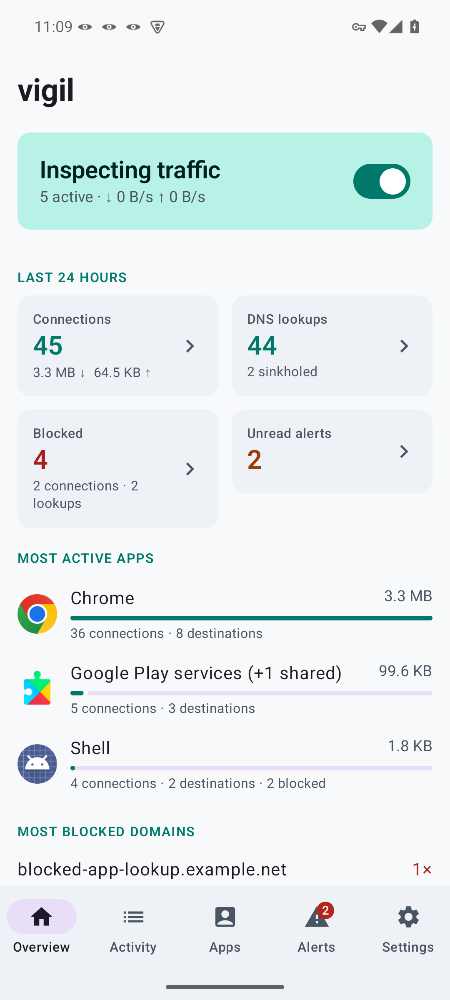
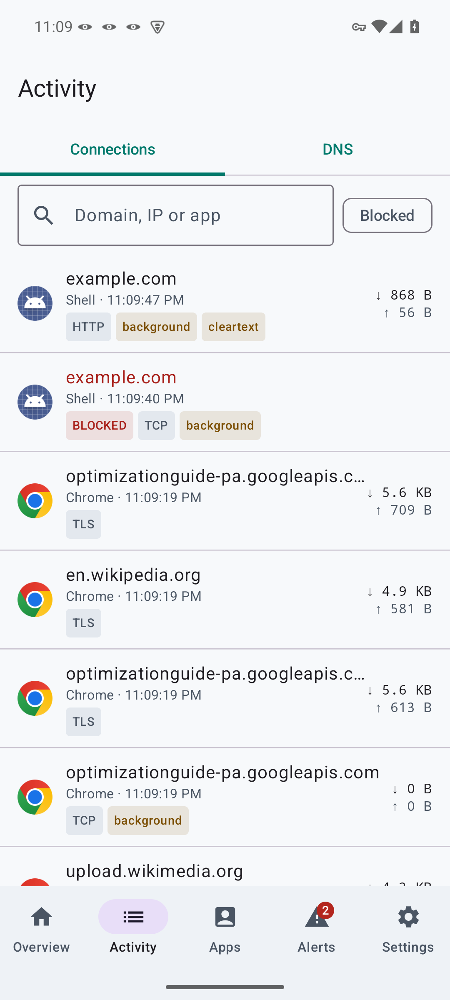
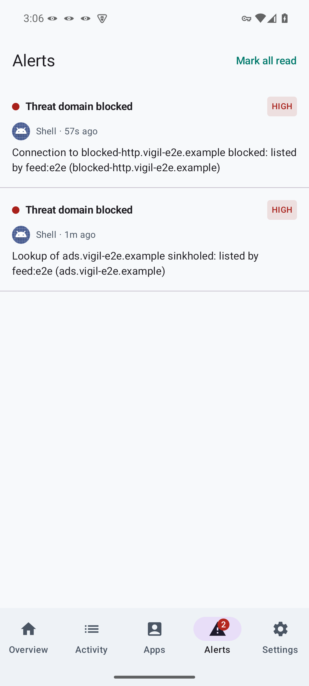

# vigil

**An on-device network inspector for Android.** vigil sees every IP connection
every app makes, attributes it to the app, names the destination, checks it
against threat intelligence, and flags suspicious behaviour. It needs no root
and no remote server, and it never decrypts traffic.

<p>



</p>

vigil uses Android's `VpnService` as a *local loop*. The TUN interface feeds
raw IP packets to a Rust engine that terminates every flow in user space,
inspects it, and relays it to the internet over ordinary sockets. Nothing is
tunnelled anywhere. No traffic data leaves the device unless you enable SIEM
export or PCAP-over-IP streaming (or export a capture file). vigil's only
own network use is downloading the feeds and data sources you leave on
(threat feeds, spyware packs, the ASN table, tracker labels) from their
publishers (see [docs/PRIVACY.md](docs/PRIVACY.md)).

## What it does

| | |
|---|---|
| **Per-app attribution** | Every connection and DNS lookup is attributed to its app through `ConnectivityManager.getConnectionOwnerUid`, including background system components. |
| **Destination names without decryption** | Names come from DNS answers, the TLS ClientHello SNI (reassembled across segments and records, which post-quantum key shares require), **QUIC Initial packets** (decrypted with the public initial keys, RFC 9001/9369) and HTTP `Host` headers. |
| **TLS fingerprints** | A [JA4](https://github.com/FoxIO-LLC/ja4) client fingerprint for every TLS and QUIC connection, matched against JA4 threat lists: a hit raises a `threat_ja4` alert naming the app and destination (blocking is opt-in, because benign clients can share a fingerprint). |
| **Threat intelligence** | Built-in feeds (HaGeZi TIF, abuse.ch URLhaus / ThreatFox / Feodo, Phishing Army, Spamhaus DROP, tracker and OEM-telemetry lists) plus custom URLs, including authenticated MISP text exports, JA4 fingerprint lists, and **TAXII 2.1 collections** (MISP, OpenCTI…) polled incrementally, with domain, IP, URL and JA4 indicators taken from STIX 2.1 patterns. Hosts, domain lists, AdGuard `\|\|domain^` rules and IP/CIDR lists are supported. A 2.3 M-domain feed loads in under 1 s and 57 MB. |
| **Tracker labels** | Destinations are labelled with the company and kind of tracker behind them ("Google · Advertising", "AppsFlyer · Mobile analytics") from [AdGuard companiesdb](https://github.com/AdguardTeam/companiesdb) (CC BY-SA 4.0, downloaded weekly by the device). Each app shows the tracker companies it contacted, grouped with categories, counts and whether they were blocked; the Apps list counts trackers per app, and SIEM records carry `vigil.tracker.*`. Labels never block by themselves. |
| **Spyware & stalkerware** | Built-in indicator packs downloaded from their publishers: the packs listed by the [Mobile Verification Toolkit](https://github.com/mvt-project/mvt-indicators) (Pegasus, Predator, NoviSpy and others, from Amnesty International, Citizen Lab and others) and [Echap](https://github.com/AssoEchap/stalkerware-indicators)'s stalkerware lists. Their servers are blocked and raise alerts naming the spyware. An offline **health check** compares installed apps (package names and signing certificates) and the recorded network history with the packs and gives a calm verdict, evidence, guidance for people at risk and an exportable report ([docs/HEALTH_CHECK.md](docs/HEALTH_CHECK.md)). |
| **Blocking** | DNS sinkholing (`0.0.0.0` or NXDOMAIN), including **CNAME-cloaked trackers**. Connections are refused by IP, SNI, QUIC SNI or HTTP Host. Custom allow/deny rules for a host or its whole site, with Undo, and a "why blocked" explanation with Always allow. |
| **Per-app firewall** | Like NetGuard: block an app always, on Wi-Fi, on mobile data, in the background or while the screen is off; open connections are cut the moment a condition starts to apply. Allow or block a domain for one app only (an allow overrides feeds for that app alone). |
| **Behavioural detection** | **Beaconing** (near-constant-interval check-ins, as new connections or as bursts inside one long-lived connection), apps **bypassing the system resolver** with hard-coded DNS servers, **encrypted DNS** use (DoH/DoT/DoQ), unusual **background upload volume**, optional **new-destination** and **new-network (ASN)** alerts, and foreground/background tagging. Alerts can be muted per app and kind, or marked as expected. |
| **Network names** | Destinations are labelled with the autonomous system announcing them (from an offline [iptoasn.com](https://iptoasn.com) table downloaded weekly), and connections show which path they took (direct, WireGuard, SOCKS5) and lookups which DNS transport answered. |
| **Upstream chaining** | Since Android allows one VPN at a time, vigil can itself send its traffic through your **WireGuard** server (imported from a wg-quick `.conf`) or a **SOCKS5** proxy such as Orbot, failing closed by default when the tunnel or proxy is down. |
| **Encrypted upstream DNS** | Optional DNS over TLS or DNS over HTTPS (HTTP/2) from vigil's resolver to Quad9, Cloudflare, Google, Mullvad or a custom server, so inspecting DNS does not mean giving up Private DNS. Fails closed unless a plain-DNS fallback is allowed. |
| **SIEM streaming** | ECS-shaped JSON over RFC 5424 syslog (UDP, TCP or TLS with optional **mutual TLS** from the Android KeyChain), HTTP NDJSON, **Splunk HEC** or **Elasticsearch `_bulk`**. |
| **Packet capture** | Optional: the raw packets of every app, as they crossed the VPN interface, kept in a bounded in-memory buffer and exported as **PCAPng** for Wireshark from a connection, an alert or an app (packets annotated with app UID and connection id), or streamed live over **PCAP-over-IP** (`wireshark -k -i TCP@phone:57012`). Off by default; nothing touches storage unless you export. |
| **Faithful relaying** | Upstream connection failures reach the app as real refusals, because the SYN is held until the upstream connect succeeds. There is no fake handshake followed by a reset. |

## Architecture in one picture

```
 apps ──► kernel routing ──► TUN (10.111.222.1, fd76:6967:696c::1)
                                  │ raw IP packets
                    ┌─────────────▼──────────────────────────────────────┐
                    │ vigil-core (Rust, tokio)                           │
                    │  dispatch ─┬─ TCP SYN ─► gate: uid, policy, connect │
                    │            ├─ TCP ─────► smoltcp stack ─► relay +   │
                    │            │                     sniff (SNI/HTTP)   │
                    │            ├─ UDP :53 ─► DNS: policy, sinkhole,     │
                    │            │             CNAME check, cache         │
                    │            └─ UDP ─────► NAT + QUIC SNI sniff       │
                    │  events (JSON) ◄── detectors (beacon, threat, DNS)  │
                    │  capture ring ──► PCAPng export, PCAP-over-IP       │
                    └───────┬──────────────────────────────┬─────────────┘
                   JNI poll │                              │ protected sockets
                ┌───────────▼───────────┐                  ▼
                │ Kotlin app            │             real network
                │ Room · Compose · SIEM │
                └───────────────────────┘
```

Details are in [docs/ARCHITECTURE.md](docs/ARCHITECTURE.md), and the event
schema is in [docs/EVENTS.md](docs/EVENTS.md). What vigil can and cannot see is
covered in [docs/PRIVACY.md](docs/PRIVACY.md). The app is translatable; see
[docs/TRANSLATING.md](docs/TRANSLATING.md) to add a language.

**Picking the project up again?** Start with [docs/STATUS.md](docs/STATUS.md)
(state, backlog, decisions), then [docs/DEVELOPMENT.md](docs/DEVELOPMENT.md)
(setup, tests, gotchas).

## Repository layout

```
core/                 Rust workspace
  vigil-core/         the engine: packet dispatch, TCP/UDP relay, DNS, TLS/QUIC/HTTP
                      parsers, policy, threat intel structures, detectors
  vigil-jni/          JNI bindings (libvigil.so)
  vigil-cli/          Linux host for the engine (testing, benchmarks, desktop use)
android/              Android app (Kotlin, Jetpack Compose, Room, WorkManager)
scripts/
  e2e-netns.sh        real traffic through the engine in an unprivileged netns
  jni-smoke.sh        drives libvigil.so from a JVM through the JNI surface
  android-e2e.sh      on-device test: install, start, generate traffic, assert DB
  android-lifecycle.sh, android-features.sh,
  android-newfeatures.sh                      on-device lifecycle and feature tests
  bench-throughput.sh throughput through the engine vs. direct
docs/                 architecture, event schema, privacy notes, health check, development, translating, status, screenshots
fastlane/             F-Droid store metadata
packaging/fdroid/     draft F-Droid recipe
```

## Building

Requirements: JDK 17+, Android SDK (platform 36) and NDK 27, and Rust with
`cargo-ndk` and the Android targets.

```sh
rustup target add aarch64-linux-android armv7-linux-androideabi x86_64-linux-android
cargo install cargo-ndk

cd android
./gradlew assembleRelease        # also cross-compiles the Rust engine
# APK: android/app/build/outputs/apk/release/app-release.apk
```

Release builds are signed with the key in `android/keystore.properties` when
that file is present (keys `storeFile`, `storePassword`, `keyAlias`,
`keyPassword`). Otherwise they fall back to the debug key, so the APK stays
installable. Pass `-Pvigil.abis=arm64-v8a` to build fewer ABIs, or
`-Pvigil.skipCargo=true` to reuse prebuilt libraries.

## Testing

| Suite | Command | Covers |
|---|---|---|
| Rust unit tests | `cd core && cargo test` | parsers (incl. RFC 9001/9369 QUIC key vectors), feeds, policy, detectors, packets |
| Engine end-to-end | `scripts/e2e-netns.sh` | 209 checks with real `dig`/`curl` through the engine: DNS UDP/TCP, sinkholing, SNI/HTTP/IP/QUIC/JA4 blocking, 1 MB up/down integrity, beacon alerts, faithful connection refusal, per-app conditions cutting open connections, PCAPng export and PCAP-over-IP, encrypted DNS, SOCKS5 and WireGuard upstreams |
| JNI | `scripts/jni-smoke.sh` | 38 checks: the exact entry points the app calls, from a real JVM |
| Kotlin unit tests | `cd android && ./gradlew testDebugUnitTest` | routes, config (incl. the JSON contracts with the engine), event parsing, SIEM records and wire formats, feed/STIX/TAXII/spyware/tracker converters, the health check |
| On device | `scripts/android-e2e.sh` | 28 checks on an emulator/userdebug device: per-app attribution, Chrome TLS SNI + JA4, sinkholing, HTTP Host blocking, per-app blocking through the UI, SIEM export to a live syslog collector, real feed downloads, screenshots, no crashes |
| On device | `scripts/android-lifecycle.sh`, `scripts/android-features.sh`, `scripts/android-newfeatures.sh` | network switches, airplane mode, Doze, engine-error restarts, process death, always-on VPN at boot, Private DNS; DoH, SOCKS5 through a proxy, fail-closed, Maximum throughput; tracker and spyware downloads, spyware sinkhole, health check, PCAP-over-IP, per-app network conditions |

The netns and JNI suites need no root. They use unprivileged user
namespaces.

## Performance

Measured with `scripts/bench-throughput.sh` (release build, x86_64 host):

- **2.9 Gbit/s** sustained through the user-space TCP stack with "Maximum
  throughput" on (two engine workers), about 1.75 Gbit/s with the default
  single worker; both far above any mobile link. Bulk transfers cost
  **5.6 s of engine CPU per GB** relayed (about half of that is the kernel
  delivering packets through the TUN device). On a real
  39 Mbit/s internet link, throughput is identical to a direct download.
- Small packets: about 5,000 short HTTP connections per second (as fast as
  without vigil), about 30,000 DNS queries or UDP request/reply pairs per
  second; 0.4 ms, 65 us and 39 us of engine CPU for each.
- An idle engine with open connections uses about 2 ms of CPU per second.
- **About 5 MB RSS** for the engine without feeds. Feeds are stored as a sorted
  string arena: 850 k domains take 21 MB and 2.3 M take 57 MB.
- `libvigil.so` is 3.2 MB (arm64; TLS and HTTP/2 for encrypted DNS take about
  1.4 MB). The release APK with three ABIs is about 14 MB.

## Requirements and limitations

- Android 10 (API 29) or later, because per-app attribution needs
  `getConnectionOwnerUid`.
- Only one VPN can be active at a time, so vigil can't run alongside another
  VPN app. Instead, vigil can send its traffic through your WireGuard server
  or a SOCKS5 proxy such as Tor/Orbot (Settings → Route through VPN / proxy),
  failing closed by default when the tunnel or proxy is down.
- If Private DNS is in **strict** mode, the OS encrypts DNS before vigil sees
  it. Names then come only from TLS/QUIC/HTTP, and the app warns about this.
- Traffic protected by real **Encrypted Client Hello** exposes only the
  provider's public name. vigil tags it, but cannot recover the real name.
- ICMP is not relayed (unprivileged apps cannot send raw ICMP), so `ping`
  through vigil fails while TCP/UDP work normally.

## License

Apache-2.0. Feed contents belong to their respective publishers and carry their
own licences.
